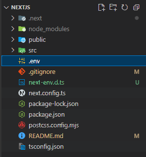

# CRUD Website Assesment | Joel - Fullstack Engineer

Assesment project for PT Informatika Media Pratama (IMP).
Made by Joel using NextJS, TailwindCSS, and DaisyUI.  
Linked In : [Click Me!](https://www.linkedin.com/in/joeldev04)  
Portfolio Website : [Click Me!](https://flexporto.vercel.app)  
Live Demo Web : [Click Me!](https://wally-post.vercel.app)  

If you need an assitance to setup the project, please contact me for an assistance!

## How To Run Procedure

Open terminal and run this commands:

First install the dependencies

```bash
npm install
```

Run website in development mode

```bash
npm run dev
```

Build and run website for production
```bash
npm run build
# and run the following command
npm run start
```

Open [http://localhost:3000](http://localhost:3000) with your browser to see the result.

## Setup .env File

Create a .env file inside your project directory  


then add these variables to your .env file
```env
NEXT_PUBLIC_fb_api_key=<firebase API key>
NEXT_PUBLIC_fb_auth_domain=<firebase auth domain>
NEXT_PUBLIC_fb_app_id=<your firebase app ID>
NEXT_PUBLIC_fb_database_url=<your firebase database URL>,
admin_service_account=<encoded base64 string of your service account from json format file>
```